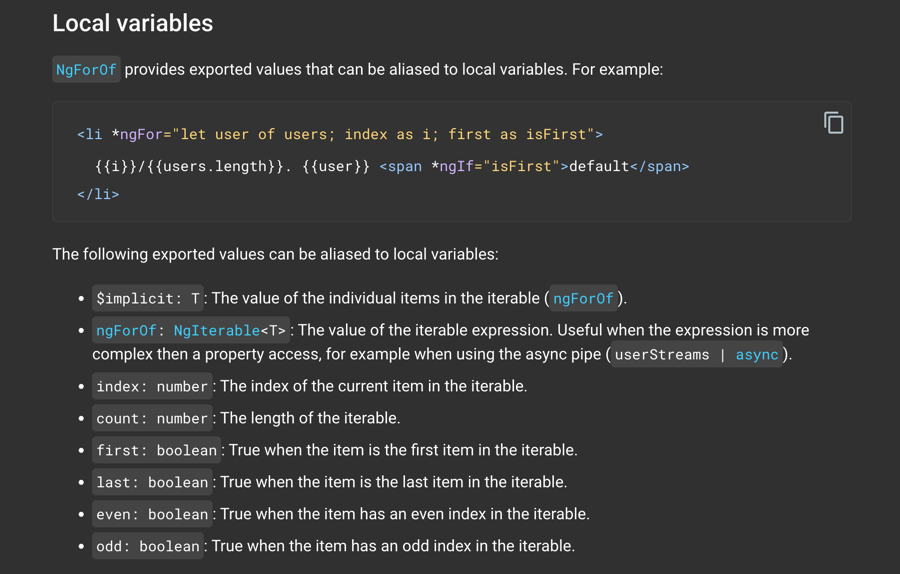
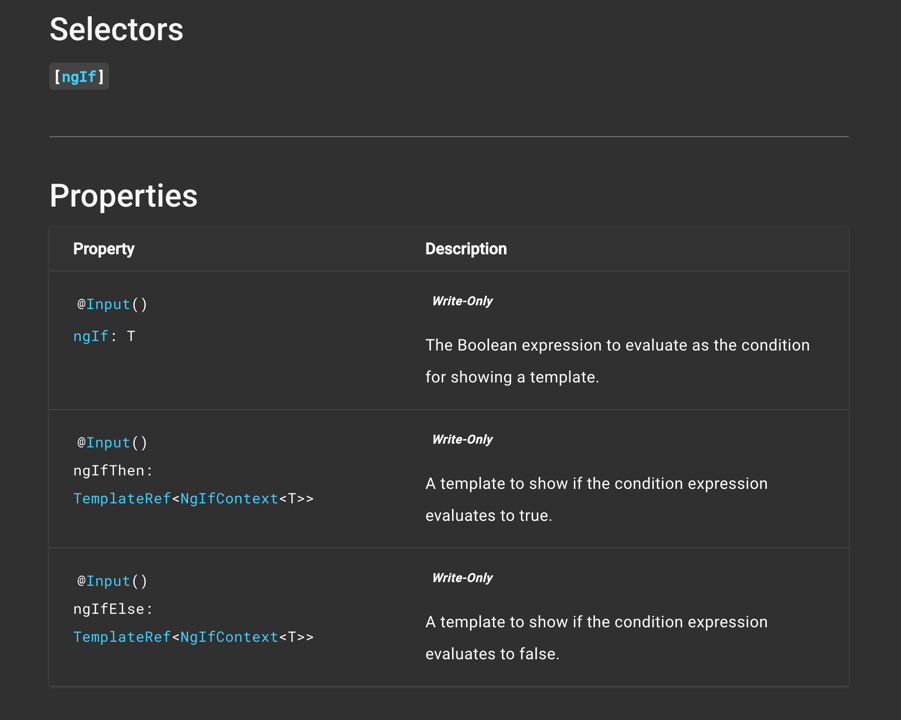
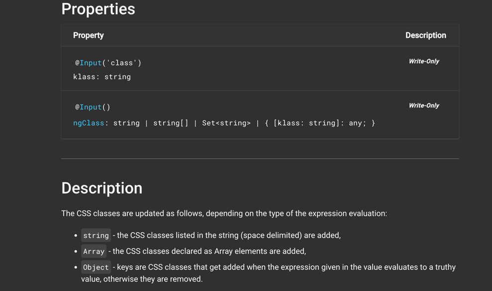

### Component:

It is a combination of **HTML + CSS +TS** is actually a variation of the MVC (Model View Controller) pattern. The *
*controller**
which would hold the logic is called a **component** in Angular, and the **view** is called a **template** in Angular.
So the
**component** should be the **TS file** and the **template** should be the **HTML file** (with the CSS if separated,
which is the case
99%)

### Event Bubbling

Native Browser events like 'click', 'keydown', 'mouseup' etc. will bubble-up<br>
Custom event listeners will not bubble-up unlike native browser events.<br>
Ref to see which events bubble-up: https://en.wikipedia.org/wiki/DOM_events#Events

### `ngFor` Directive
Importance of **trackBy** function: https://youtu.be/F3nv4Lclv4Q <br>
ngFor API Ref: https://angular.io/api/common/NgFor



### `nfIf` Directive
ngIf API Ref: https://angular.io/api/common/NgIf



### `nfClass` Directive
ngClass API Ref: https://angular.io/api/common/NgClass



```html
<some-element [ngClass]="'first second'">...</some-element>

<some-element [ngClass]="['first', 'second']">...</some-element>

<some-element [ngClass]="{'first': true, 'second': true, 'third': false}">...</some-element>

<some-element [ngClass]="stringExp|arrayExp|objExp">...</some-element>

<some-element [ngClass]="{'class1 class2 class3' : true}">...</some-element>
```
