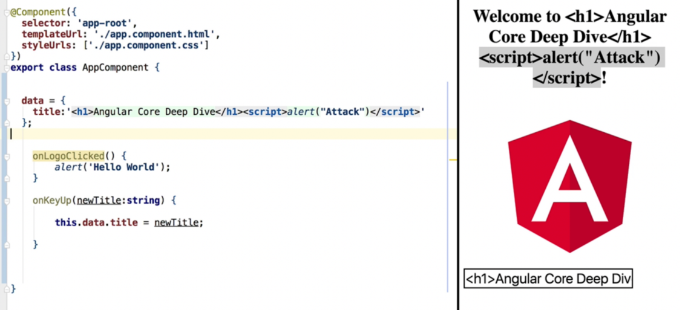

## Introduction

### Initial steps

##### 1. Make sure you have the latest node installed on your machine
   https://nodejs.org/en/

##### 2. Install angular cli globally

```bash
npm install -g @angular/cli
```

##### 3. Scaffold new angular application using below command

```bash
ng new project-name
```

_____________________________________________

**Model(Data)**: Typescript file <br>
**View(Template)**: HTML file <br>
**Styling**: SCSS file

### Angular built-in security.




