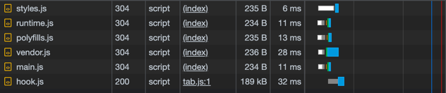

## How does the angular application starts execution?

1. It all starts with **angular.json** which webpack uses to bundle and do its magic.
2. In angular.json, we have the main property that points to **main.ts**.
3. Inside the **main.ts**, we bootstrap the module that angular needs to start with.
4. So we bootstrap **appModule**. In the **app.module.ts**, we attach the AppComponent in the **bootstrap:[]** to let
   angular know that this is the first component that angular should load. Its selector is <app-root>.
5. This is used inside the **index.html**  as the element to start with. Also, in angular.json, we mention index.html as
   the index property to let angular know, hey this is the only HTML that you should consider.

**Note:** Bootstrapping basically meant, bootstrap in general means loading and initializing your app.<br>
Making the application compile and doing the whole setup to make it ready to be shown on the page.

Usually, webpack is installed as a npm package and the configurations are done within the **webpack.config.js** file it
can
support any kind of file if we can provide the corresponding loader.<br>
But the pain of understanding webpack, identifying the loaders, and arranging properly for the most optimized output is
something that angular abstracts within angular-cli. You won't be able to see it.<br>
As far as I know, angular-cli is nothing but a sugar-coated wrapper around webpack, so it's nothing like first this
executes, then that executes!

## Bootstrapping mechanism a little more in detail:

1. The browser looks by default for an **index.html** file first (this is the same for an Angular app as for a
   traditional
   web app, since the browser can't know in advance the type of our app).
2. When your app is compiled, the JavaScript bundles are appended in script tags to index.html (as you can see in the
   Elements tab of the browser’s dev tools, or if you inspect the source code of your app with Ctrl + U).
3. Angular starts with the **main.ts** file, which is on top of the main.js bundle. There **AppModule** is defined as
   **bootstrapModule**.

    ```js
    platformBrowserDynamic().bootstrapModule(AppModule)
      .catch(err => console.error(err));
    ```

   It's a single line, but it does a lot. **platformBrowserDynamic** is a module that is able to **load Angular in the
   context of a Web browser**. It loads the necessary elements of the framework and configures what needs to be.
   <br><br>
   So, the first part, platformBrowserDynamic() loads Angular. Once that is done, the second part **bootstrapModule(...)
   instructs Angular to bootstrap the given module**. By default, all Angular applications include at least an AppModule.
   <br><br>
   At this point, **Angular takes over**, loads the components, services, directives, pipes, and whatever else your
   AppModule may import, refer to, declare, etc. In fine, it will look for a component matching the app-root selector.
   <br>
4. In AppModule’s bootstrap array **AppComponent** is defined as the root component of the app. The selector of this
   component, app-root, is defined in app.component.ts. Angular finds this selector in **index.html**, initializes this
   component and inserts the generated HTML from the template in index.html.
5. All other components are nested into the root component directly or indirectly, either by placing their selectors
   into the template of their parent component, or by defining routes in AppModule resp. AppRoutingModule.
   When Angular finds a selector somewhere in a template, it knows which component or directive has to be applied in
   this place. Angular knows all the selectors and their related components/directives since they are registered in
   their module's declarations array

## JS bundles loaded on backgrounds:



* **main.js**: your application code and everything you have imported
* **polyfills.js**: polyfills that allow using newer features in older environments (e.g., using Angular on outdated Web
  browsers)
* **styles.js** contains the styles you configured in the styles section of your .angular.json
* **vendor.js**: third-party code that your application depends on.
* **runtime.js**: utility code used by Webpack to load code at runtime
* scripts.bundle.js contains the scripts you configured in the scripts section of your .angular.json<br>
  The numbered chunks contain the **lazy-loaded** modules.

Ref: https://www.dsebastien.net/2021-03-28-angular-application-bootstrap/

